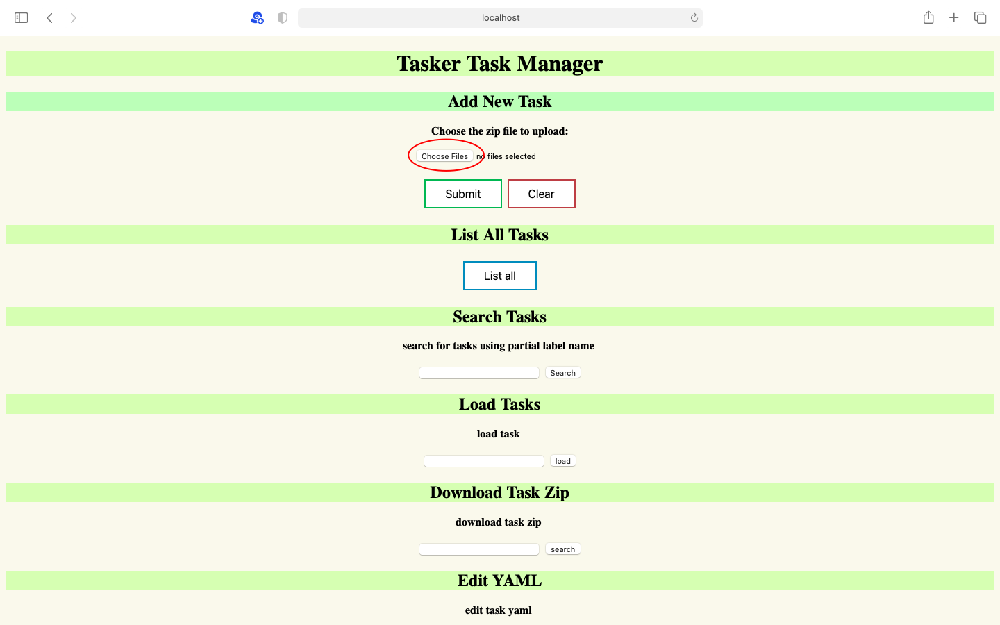
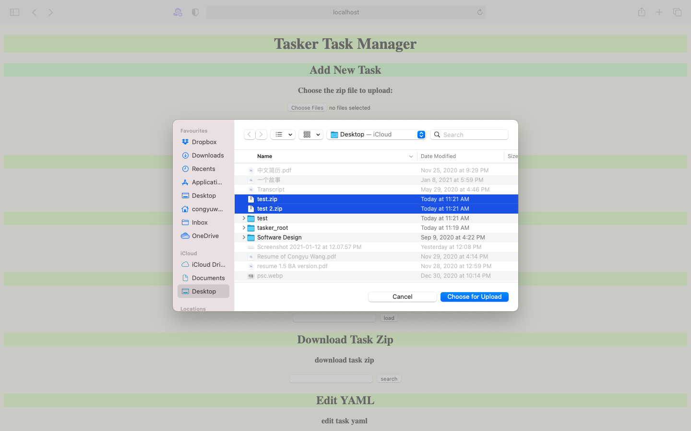
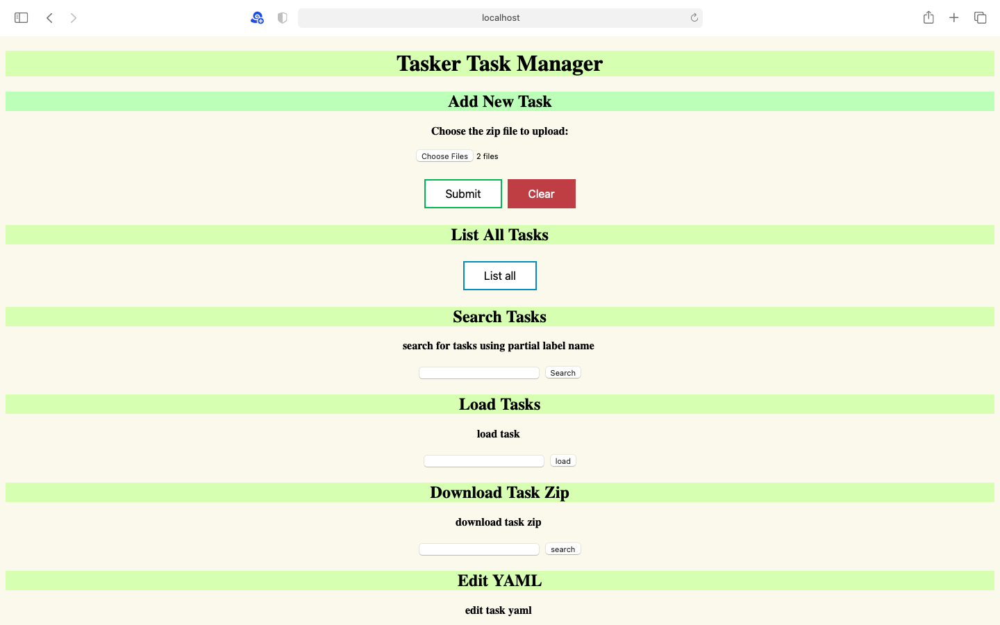
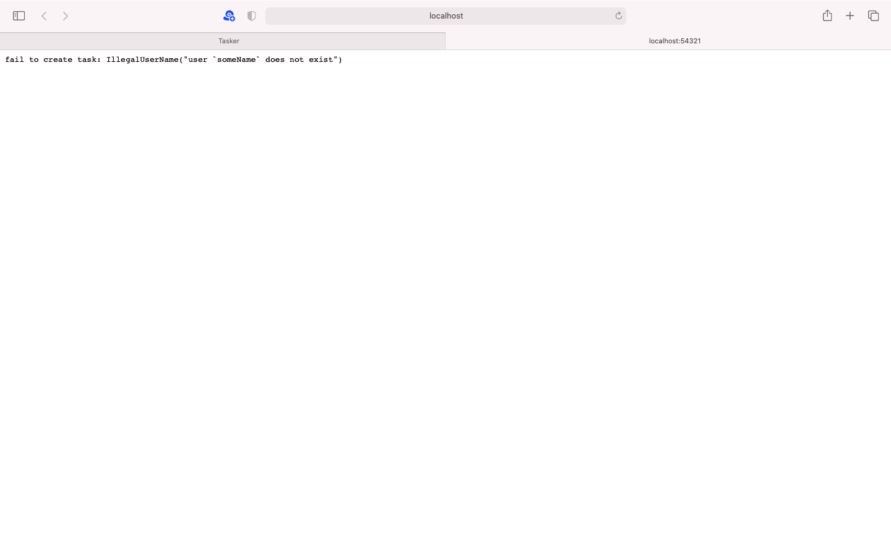
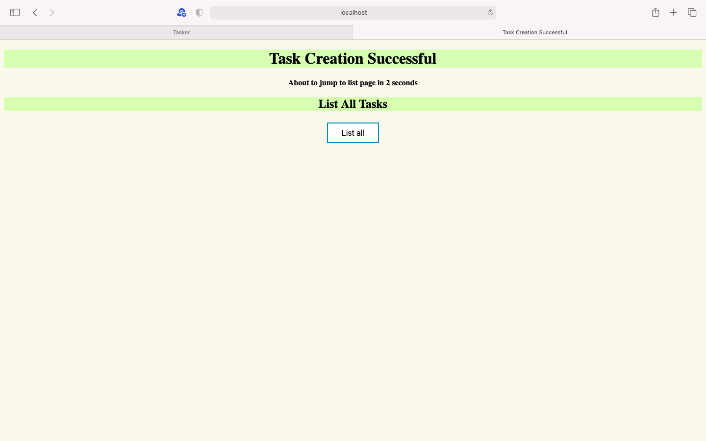
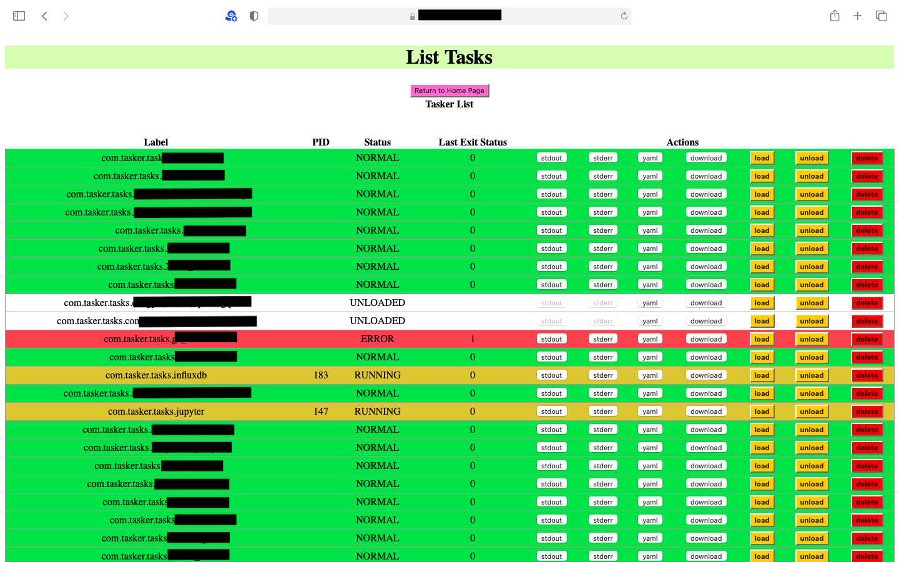
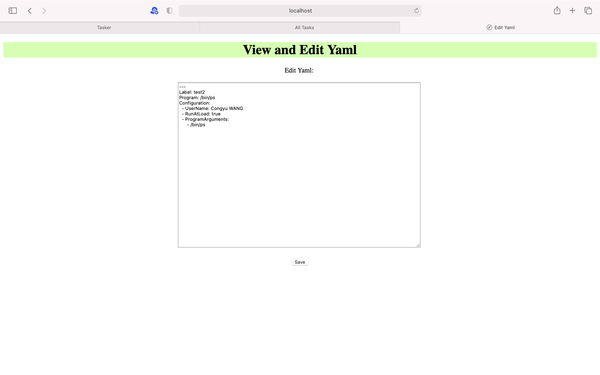

# Tasker

`Tasker` is a rust program for `MacOS` that provides an easy web user interface for publishing tasks in `launchd`. It enables remote management of MacOS tasks.

## Usage

Must run with `root` priviledge! Command `sudo ./rust` or set as a task in `/Library/LaunchDaemons`.

## Environmental Variables

| Env Var Name | Is Required? | Requirement |
| :--- | :---: | :--- |
| TASKER_ROOT | REQUIRED | need to be a Path |
| USERNAME | REQUIRED | at least 5 characters |
| PASSWORD | REQUIRED | at least 12 characters |
| SSL_PRIVATE_KEY | Optional | openssl private key |
| SSL_CERTIFICATE | Optional | openssl certificate |
| DOMAIN | Optional | default to be `localhost`, follow regex `^[A-Za-z0-9]{1,63}(\\.[A-Za-z0-9]{1,63})*$` |
| PORT | Optional | default to be `54321`, non-negative integer equal to or less than `65353` |

## User Interface

Open the web page defined by `http(s)://$(DOMAIN):$(PORT)` or by default `http://localhost:54321` in any browser, and login with $USERNAME and $PASSWORD.

### Task Creation

To create a task, create a `zip` file containing a `.yaml` task configuration file and other supporting files. (Please view the next YAML Configuration part for detail about YAML file).

Click on `Choose Files` and choose needed zip files. Support multiple selections:







Afterwards, click `Submit` to submit the task, or click on `Clear` to clear the selection. After submission, if task creation is considered as a failure, the web page will display failure reason, which might be caused by wrong `YAML` configuration, for instance:



If the task creation is successful, the web page will open the following page:



Note: ⚠️task creation will cover, stop and reload old tasks with the same task `Label`.

### Task Management

To manage tasks, click on `List All`, which opens a page of several tasks:



#### Task Status

The `Status` column of the list has several possibilities, they correspond to `White`⬜️ `Green`🟩, `Orange`🟧, and `Red`🟥 colors of each row.

| Status | Explanation | Color |
| :--- | :--- | :---: |
| UNLOADED | not yet loaded in to launchd system, nor is the configuration files (launchd.plist) placed into system directory | ⬜️ |
| LOADED | loaded, but not yet having been run at least once | ⬜️ |
| NORMAL | having been run at least once and has return code `0` | 🟩 |
| ERROR | return code is **NOT** `0` after the last run | 🟥 |
| RUNNING | the process is currently running, and the `pid` column is not empty | 🟧 |

#### Actions

There are possible actions including `stdout`, `stderr`, `yaml`, `download`, `load`, `unload`, `delete` for each task.

| Action | Explanation |
| :--- | :--- |
| `stdout` | view standard output (e.g., in python, output of `print()` function) in a new page |
| `stderr` | view standard error (e.g., in python, output of `panic()` function) in a new page |
| `yaml` | edit and `save` yaml in a new page |
| `load` | load a task into MacOS system |
| `unloaded` | unload a task from MacOS system |
| `delete` | delete a task from Tasker system |

#### Edit Yaml

After clicking on `Yaml`, open a new page for editing task configuration:



Click the `Save` button to save the yaml (and reload the task if it is not in `UNLOADED` state).

## YAML Configuration

The simplest yaml example:

```{yml}
---
Label: test2
Program: /bin/ps
Configuration:
  - ProgramArguments:
      - /bin/ps
```

General guidance:

1. YAML uses 4-space indentation in general, but when there is a `- ` prefix, only uses 2-space indentation.
2. Use `- ` for each item in an array.
3. the `⚠️Requirement` specified in the following explanations are checked when YAML is updated, or when new task is submitted.

### Required fields:

| Required Fields | type | Explanation |
| :--- | :---: | :--- |
| Label | string | a unique identifier of the task, this is used as an **ID** of tasks in `Tasker` system |
| Program | string | the Program argument points to the `binary file` of the program to run |
| Configuration | array |it should at least contain one `ProgramArguments` |

### Optional configurations:

Optional configurations are placed under `Configurations` like this:

```{yml}
---
Label: test2
Program: /bin/ps
Configuration:
  - ProgramArguments:
      - /bin/ps
  - Opt1
  - Opt2
  - ...
```

Possible Optional configurations include (some are omitted):

#### `RunAtLoad`: boolean

If this is true, the task will run immediately after been loaded.

Example: 
```{yml}
---
Label: test2
Program: /bin/ps
Configuration:
  - ProgramArguments:
      - /bin/ps
  - RunAtLoad: true
```

⚠️Requirement: must either be `true` or `false`

#### `StartCalendarInterval`: array of calendar intervals

##### Example 1

start at 8am everyday:
```{yml}
---
Label: test2
Program: /bin/ps
Configuration:
  - ProgramArguments:
      - /bin/ps
  - StartCalendarInterval:
      - Minute: 0
        Hour: 8
```

##### Example 2

start at the following time:
1. 2pm every Monday
2. 8am everyday
3. January 1st every year
```{yml}
---
Label: test2
Program: /bin/ps
Configuration:
  - ProgramArguments:
      - /bin/ps
  - StartCalendarInterval:
      - Minute: 0
        Hour: 14
        Weekday: 1
      - Minute: 0
        Hour: 8
      - Day: 1
        Month: 1
```

Possible time parameters: `Minute`, `Hour`, `Weekday`, `Day`, `Month`

⚠️Requirements:

- Minute: 0-59
- Hour: 0-23
- Weekday: 0-7
- Day: 1-31
- Month: 1-12

#### `UserName`: string

Run this task with a particular user of the MacOS system, related to priviledges of file system. If this filed is missing, the task run with `root` user.

Example: 
```{yml}
---
Label: test2
Program: /bin/ps
Configuration:
  - ProgramArguments:
      - /bin/ps
  - UserName: Congyu WANG
```

⚠️Requirement: must be a valid user in the system.

#### `GroupName`: string

Similar to `UserName`, run this task with priviledge of the specified group.

Note: When `GroupName` is missing, the system automatically chooses the primary user of the group as username.

⚠️Requirement: must be a valid group name in the system.

#### `KeepAlive`: dict

Conditions for keeping the task running. Currently there are 2 options available:

- SuccessfulExit: boolean
- Crashed: boolean

Explanation:

- If `SuccessfulExit` is set to `true`, the task will rerun after successful exit with return code 0.
- If `SuccessfulExit` is set to `false`, the task will rerun after failed exit with non-0 return code.
- If `Crashed` is set to `true`, the task will rerun if the task is exited due to a signal which is typically associated with a crash (SIGILL, SIGSEGV, etc.).
- If `Crashed` is set to `false`, the task will rerun if the task is **NOT** exited due to a signal which is typically associated with a crash (SIGILL, SIGSEGV, etc.).

##### Example

keep alive if crashed or error exit:

```{yml}
---
Label: test2
Program: /bin/ps
Configuration:
  - ProgramArguments:
      - /bin/ps
  - KeepAlive:
      - Crashed: true
      - SuccessfulExit: false
```

⚠️Requirement must be boolean value

#### `StartInterval`: int

`- StartInterval: N` means run every other N seconds.

⚠️Requirement: N > 0.

#### `WorkingDirectory`: string

Working directory for the path.

⚠️Requirement: must point to a valid (existing) directory.

## Notes

1. ⚠️IMPORTANT! For security concern, always use SSL encryption and username+password for remote visiting of `Tasker`⚠️. The webpage uses Basic Http Authentication, which is safe only under HTTPS connection.
2. Make sure that your program return other than `0` if it is not working as expected.
3. `stdout` and `stderr` are cleared automatically after creating new tasks and updating (edit and save) yaml.
